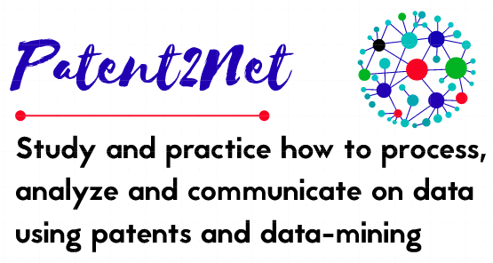

# P2N-Docker

[]
[]

Dockerfile and installation scripts for Patent2Net (P2N) suite. This repository replaces the branch "docker-install" of P2N-V3 repo and is now the main entry point to Patent2Net.

     _____      _             _     ___    _   _      _           _____   ___    _   _ 
    |  __ \    | |           | |   |__ \  | \ | |    | |      /  |  __ \ |__ \  | \ | | \
    | |__) |_ _| |_ ___ _ __ | |_     ) | |  \| | ___| |_    /   | |__) |   ) | |  \| |  \
    |  ___/ _` | __/ _ \ '_ \| __|   / /  | . ` |/ _ \ __|   |   |  ___/   / /  | . ` |   |
    | |  | (_| | ||  __/ | | | |_   / /_  | |\  |  __/ |_     \  | |      / /_  | |\  |  /
    |_|   \__,_|\__\___|_| |_|\__| |____| |_| \_|\___|\__|     \ |_|     |____| |_| \_| /       

What's new ?
-------------
* [Patent2Net](https://github.com/Patent2net/P2N-v3) comes now in *version 4*.
* P2N now works in Docker mode. To install it simply download this repository and follow this:
  * launch install.bat (should be linux and MacOS friendly) in administrator provilege mode to create a symlink directly to the DATA directory of P2N
  * The script RunP2N allows you to start the P2N suite. 
  * The script StopP2N to revert. This may lead to data loss. Use Pause Unpause batch file to turn off your computer safelly. Don't forget to restart docker at relauch.
  
* Patent2Net now integrate an user interface to enter request instead of creating cql file.
 * To access it you need to launch app.py and go to 127.0.0.1:5000 with your web browser
 * DATA stuff directly.
 * Update is operated using the "UPDATE" button. Silly, ins't it?

> In short,  click on the install.bat to build the docker image and install P2N on it.

**WARNING**: You will need at least 8Gb disk space free on you host. 

* This repo comes also with two giants helpers in data analysis: 
 1. [ElasticSearch](https://www.elastic.co/) 
 2. [Kibana](https://www.elastic.co/fr/kibana) servers. 
 
 
 > You can access a straightforward installation using the subdirectory install file in config directory. This will allow you to hack several features of kibana and elasticsearch.
 
### Note 
 * ES is also upgraded with [Carrot2](https://github.com/carrot2/carrot2) [ElasticSearch Plugin](https://github.com/carrot2/elasticsearch-carrot2)
 * Carrot2 [Document Clustering Service](https://carrot2.github.io/release/4.0.4/doc/rest-api-basics/) is also "ready to install" by uncommenting the good lines in DockerFile. But this is only is you know how to use it in order to replace the _ES-Kibana servers_.
 * Of course only the open source features are allowed but this installation is still open for every paid features offered by cited tools.

### P2N docker special features
* Centos image with P2N automatically installed
* RUN_P2N scripts starts a flask server to provide a standalone web server and serves P2N functions and files. See http://localhost:5000
* Patent2Net now integrate an user interface to enter request instead of creating cql file... And Read the doc...
* Update is operated using the "UPDATE" button. Silly, ins't it?
* opens a bash shell (use P2N_Bash.bat scripts) on this docker machine assuming you know what you do...

### P2N essential features covered
* Patent2Net interface you to [European Patent Organisation](https://www.epo.org/) worldwide database to gather patent documents set in answer to your requests 
* Patent2Net interface several software to build indicators and help analyse: [Datatable](https://datatables.net/), [Pivot table](https://pivottable.js.org/examples/)
* Patent2Net provides files compatible with two major open source projects in text analysis say [IRaMuTeQ](http://iramuteq.org/) and document clustering (the already named Carrot2)[Carrot2](https://github.com/carrot2/carrot2). But these programs have to be installed by your way. P2N provide data in compatible format for the distributions.
* Patent2Net build as well network files from patent Metadata. Assuming some trivial hypothesis that co-authors of a patent works together... Same for co-applicants: so networks analyses aims to help in exploring who works for who, who works with who... And so on. Same with the  [International Patent Classification](https://www.wipo.int/classifications/ipc/en/) that provides language independent views on patent sets. This P2N version integrate inline interface to those networks (see the link in page data synthesis) but the interface with network is not friendly enought. We recommend the use of the exported files in gexf format compatible with the wondefull Open Graph Viz Platform [Gephi](https://gephi.org/) that you may install on your machine.
* Patent2Net, aside HTML5, exports also in several format: CSV, Excel, BibTex for [Zotero](https://www.zotero.org/) import.
### Undocumented features
* some extra additional features comes also within the makefile... Help us to improve the docs and the projects

Who we are
----------
[Patent2Net](http://patent2netv2.vlab4u.info/dokuwiki/doku.php?id=page) is :
* elaborated and maintained (on a free base) by a [small international team](http://patent2netv2.vlab4u.info/dokuwiki/doku.php?id=about_p2n:community;) of university professors and researchers.  
* an "open source" package and contributions are welcome

License
-------
Aside integrated open-source sofware that leads their own licence, the Patent2Net code is covered by the `CECILL-B licence <https://cecill.info/licences/Licence_CeCILL-B_V1-en.html>`_. 

THE SOFTWARE IS PROVIDED “AS IS”, WITHOUT WARRANTY OF ANY KIND, EXPRESS OR IMPLIED, INCLUDING BUT NOT LIMITED TO THE WARRANTIES OF MERCHANTABILITY, FITNESS FOR A PARTICULAR PURPOSE AND NONINFRINGEMENT. IN NO EVENT SHALL THE AUTHORS OR COPYRIGHT HOLDERS BE LIABLE FOR ANY CLAIM, DAMAGES OR OTHER LIABILITY, WHETHER IN AN ACTION OF CONTRACT, TORT OR OTHERWISE, ARISING FROM, OUT OF OR IN CONNECTION WITH THE SOFTWARE OR THE USE OR OTHER DEALINGS IN THE SOFTWARE.

Objectives
----------
Patent2Net is a free package, dedicated to :
* promote the use of patent information in academic, nano and small firms, developing countries
* learn, study and practice how to collect, treat and communicate "textual bibliographic information", and automation process
* provide statistical analysis and representations of a set of patents
* learn skills in data-mining software, Data analysis, Textual data-mining, distance reading, knowledge discovery

The example [results](http://patent2netv2.vlab4u.info/) of statistical patents analysis can be exported to a website with the firefox browser.

